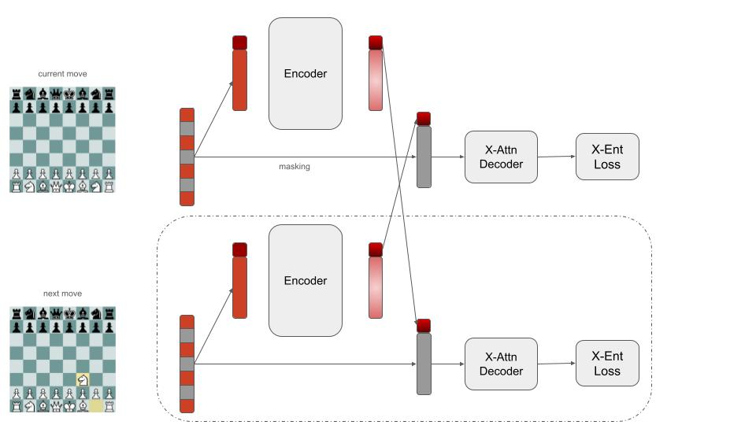
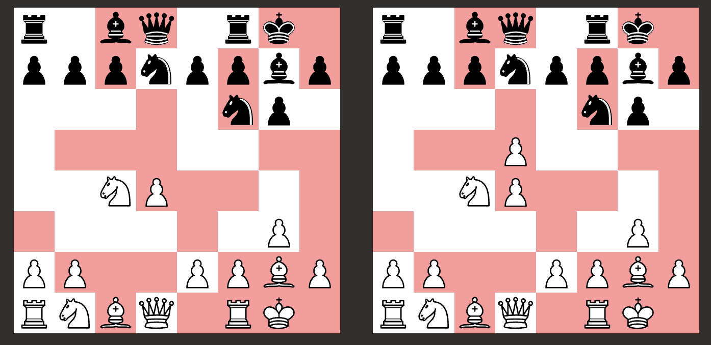

# ChessBot
I want to build the strongest chess player I can without relying on human-guided strategy or an oracle. Stockfish, prepare to enter the barrel.

## Model Training
### A 3-Pronged Approach

### 1. Self-Supervised Learning
This step has a low data quality threshold. I am using pgn data from this website: https://lumbrasgigabase.com. 
As far as I can tell it employs some basic ELO pruning and de-duplication. Good enough for me. 
For the exploratory phase of this project I am using just the games from 2024. About 2 million games. At ~90% GPU utilization it takes about a day to train on the full dataset with 1x 3090 RTX.

#### Model Architecture
I wanted to do something higher brow than just copy-pasting BERT, so the backbone training takes inspiration from a few sources, namely:
- [Cross-MAE](https://crossmae.github.io)
- [VideoMAE](https://arxiv.org/abs/2203.12602)
- [BERT](https://arxiv.org/abs/1810.04805) (of course)

The following figure might help explain the high level design:

Here, a masking objective is used as a pretext task, with information from the time dimension being integrated with tube masking, as in VideoMAE. 
The class tokens are switched during decoding, such that the next board class token is used to predict the masked region of the current board and vice versa.
The reason to do this is to encourage the model to summarize the board in a small embedding, and to have that embedding be useful for predicting the likely next board in a game.
After around 18 hours of training the results are pretty good:

Screenshot from a Magnus Carlsen game after white has just castled with 50% masking. Current board on the left, model prediction on the right. Red squares represent masked positions.

### 2. Move Prediction

### 3. Self-Play with PPO
